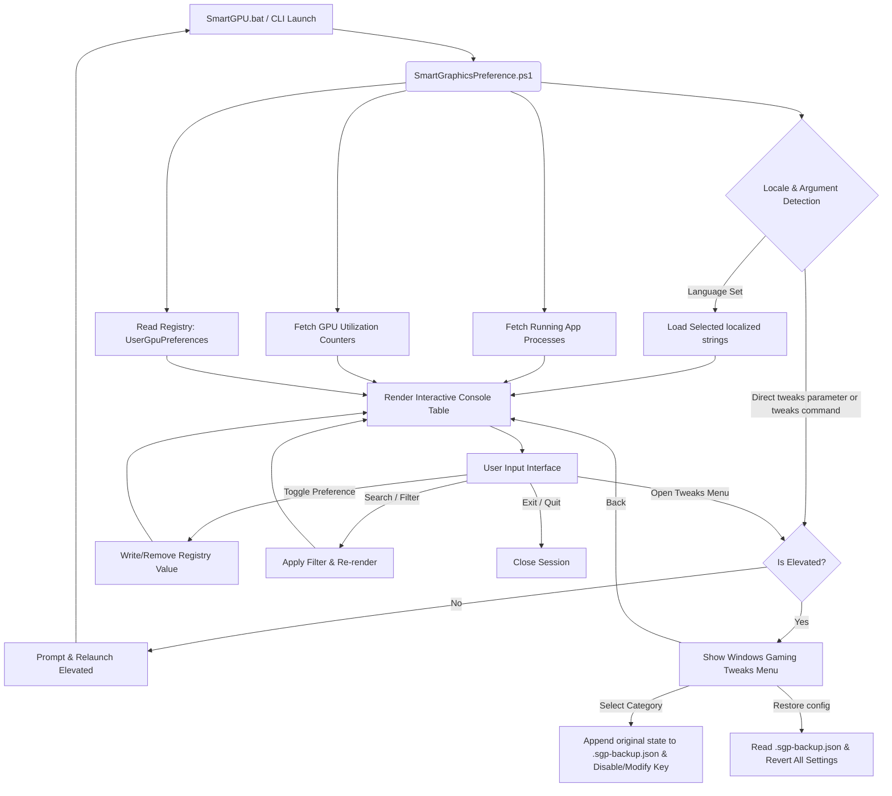

# ARCHITECTURE.md

## High-Level System Architecture
This utility runs as a single-module CLI script with zero external runtime dependencies. It interacts directly with the Windows Registry API, Local Services API, and system power management tools.

---

## Component Details

### 1. Script Entry & Parameters
- **Script File:** [SmartGraphicsPreference.ps1](file:///c:/Users/User/Desktop/SmartGPU/claude_analisar/SmartGraphicsPreference.ps1)
- **Startup Parameters:**
  - `[string]$Language`: Optional. Force English (`en`), Portuguese (`pt`), Spanish (`es`), French (`fr`), German (`de`), Chinese (`zh`), Japanese (`ja`), or Italian (`it`).
  - `[string]$Menu`: Optional. Jump directly to a sub-menu (e.g. `tweaks`).
- **Batch Wrapper:** [SmartGPU.bat](file:///c:/Users/User/Desktop/SmartGPU/claude_analisar/SmartGPU.bat) forwards all parameter arguments using `%*`.

### 2. Localization System
- Encapsulated inside a single `$translations` multi-dimensional hashtable.
- UI elements, column names, categories, command keywords, status tags, and tweaks menu instructions are fully mapped to keys.
- Input validation matches user-typed keywords against both English defaults and localized aliases.
- Handles console output translation by setting `[Console]::OutputEncoding = [System.Text.Encoding]::UTF8` to correctly render CJK and accented characters.

### 3. Registry Management
- **Target Hive:** `HKEY_CURRENT_USER` (allows GPU preferences modification without admin privileges).
- **Target Key Path:** `HKCU:\SOFTWARE\Microsoft\DirectX\UserGpuPreferences`
- **Preference Values:**
  - `GpuPreference=2;` — Sets High Performance.
  - Value property removal — Reverts to Windows Default (application fallback).
  - *Note: Registry API commands used are `Get-ItemProperty`, `Set-ItemProperty`, and `Remove-ItemProperty`.*

### 4. Process Scan & GPU Utilization
- **Process Scan:** Retrieves running processes with `Get-Process`. Filters out items present in `$systemProcessNames` and processes without a valid executable path.
- **GPU Counter Query:** Queries `\GPU Engine(*engtype_3D*)\Utilization Percentage` using `Get-Counter`.
  - Extract PID via Regex match: `pid_(\d+)`
  - Calculates maximum 3D utilization percent per active process.

### 5. Windows Gaming Tweaks System
- Requires administrator privileges (`RunAs` verb relaunch check if standard permissions).
- **Dynamic Backup:** Creates a local `.sgp-backup.json` configuration snapshot. Original values are appended dynamically before settings are modified.
- **Category 1 (Services):** Modifies StartupType to `Disabled` for `Spooler`, `Fax`, `SysMain`, `WerSvc` via `Set-Service`.
- **Category 2 (Network):** Configures low TCP Latency values (`TcpAckFrequency` = 1, `TcpNoDelay` = 1) under active IP interface keys in `HKLM:\SYSTEM\CurrentControlSet\Services\Tcpip\Parameters\Interfaces`. Configures Multimedia Network Throttling and Game Responsiveness policies in `HKLM:\SOFTWARE\Microsoft\Windows NT\CurrentVersion\Multimedia\SystemProfile`.
- **Category 3 (Visuals & Power Plan):** Configures visual effects for best performance (`VisualFXSetting` = 2) in registry and duplicates/activates the "Ultimate Performance" system power scheme.
- **Category 4 (Telemetry & Privacy):** Disables system logging telemetry policies and stops/disables the `DiagTrack` service.
- **Category 5 (Game Bar & Xbox):** Disables Game DVR registry hooks and Xbox Live services (`XblAuthManager`, `XblGameSave`, `XboxNetApiSvc`).

### 6. Packaging / Standalone Executable
- **Build Script:** [build/build.ps1](file:///c:/Users/User/Desktop/SmartGPU/claude_analisar/build/build.ps1)
- Packages the script into a console executable `SmartGraphicsPreference.exe` using `ps2exe`.
